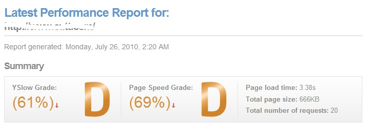

title: 用GTmetrix来优化你的网页（集成了YSlow、FireBug的功能）
author: wen
tags:
  - 性能优化
categories:
  - 性能优化
date: 2017-02-28 14:57:00
---
<Excerpt in index | 首页摘要>
网址是：http://gtmetrix.com/ ，输入自己需要分析的链接，稍微等会儿，有两个得分，一是YSlow的分析得分，二是PageSpeed的分析得分。
<!-- more -->
<The rest of contents | 余下全文>

一般互联网的网站，得分要达到C（包含A和B）以上，最好能达到B。

## YSlow的检查项目
  ### Leverage browser caching  浏览器缓存
  Page load times can be significantly improved by asking visitors to save and reuse the files included in your website. 要求访问者保存和重复使用您网站中包含的文件，可以显着提高页面加载时间。
      
  ### Specify a cache validator 指定缓存验证器   
All static resources should have either a Last-Modified or ETag header. This will allow browsers to take advantage of the full benefits of caching.所有静态资源应具有Last-Modified或ETag头。 这将允许浏览器利用缓存的全部好处。

 ### Optimize images 优化图片
Reduce the load times of pages by loading appropriately sized images.通过加载适当大小的图像减少页面的加载时间。

### Specify image dimensions 指定图片大小
Specifying a width and height for all images allows for faster rendering by eliminating the need for unnecessary reflows and repaints.为所有图像指定宽度和高度允许通过消除对不必要的回流和重绘的需要来更快地呈现。

### Enable gzip compression 启用gzip压缩

Reduce the size of files sent from your server to increase the speed to which they are transferred to the browser.减少从服务器发送的文件的大小，以提高它们传输到浏览器的速度。

### Minify JavaScript 缩小javascript
Compacting JavaScript code can save many bytes of data and speed up downloading, parsing, and execution time.压缩JavaScript代码可以节省大量数据字节，并加快下载，解析和执行时间

### Minify HTML 缩小HTML
Compacting HTML code, including any inline JavaScript and CSS contained in it, can save many bytes of data and speed up downloading, parsing, and execution time.压缩HTML代码，包括其中包含的任何内联JavaScript和CSS，可以节省许多字节的数据，加快下载，解析和执行时间。

### Specify a Vary: Accept-Encoding header

Bugs in some public proxies may lead to compressed versions of your resources being served to users that don't support compression. Specifying the Vary: Accept-Encoding header instructs the proxy to store both a compressed and uncompressed version of the resource.一些公共代理中的错误可能导致向不支持压缩的用户提供资源的压缩版本。 指定Vary：Accept-Encoding标头指示代理存储资源的压缩和未压缩版本。

### Remove query strings from static resources 从静态资源中删除查询字符串

Most proxies, most notably Squid up through version 3.0, do not cache resources with a "?" in their URL even if a Cache-control: public header is present in the response. To enable proxy caching for these resources, remove query strings from references to static resources, and instead encode the parameters into the file names themselves.大多数代理，最引人注目的是Squid通过3.0版本，不缓存资源与“？ 即使在响应中存在Cache-control：public标头，也可以在其URL中查找。 要为这些资源启用代理缓存，请从静态资源引用中删除查询字符串，而不是将参数编入文件名本身。

### Avoid bad requests 避免不良的请求
Removing "broken links", or requests that result in 404/410 errors, avoids wasteful requests.删除“损坏的链接”或导致404/410错误的请求，可避免浪费的请求。

### Avoid landing page redirects 避免着陆页重定向
Redirections on landing pages add delays to the page load and while the redirections are occurring, nothing is shown to the client. In many cases, redirections can be eliminated without changing the function of a page.着陆页的重定向会增加页面加载的延迟，并且当重定向发生时，客户端不会显示任何内容。 在许多情况下，可以消除重定向而不改变页面的功能。

### Defer parsing of JavaScript 延迟JavaScript的解析
In order to load a page, the browser must parse the contents of all <script> tags, which adds additional time to the page load. By minimizing the amount of JavaScript needed to render the page, and deferring parsing of unneeded JavaScript until it needs to be executed, you can reduce the initial load time of your page.为了加载页面，浏览器必须解析所有<script>标签的内容，这会给页面加载增加额外的时间。 通过最小化呈现页面所需的JavaScript量，并推迟对不需要的JavaScript进行解析，直到需要执行它，您可以减少页面的初始加载时间。

### Enable Keep-Alive 启用保持活动
Enabling HTTP Keep-Alive or HTTP persistent connections allow the same TCP connection to send and receive multiple HTTP requests, thus reducing the latency for subsequent requests.启用HTTP Keep-Alive或HTTP持久连接允许同一TCP连接发送和接收多个HTTP请求，从而减少后续请求的延迟。

### Inline small CSS 内联小型外部CSS文件
Inlining small external CSS files can save the overhead of fetching these small files. A good alternative to inline CSS is to combine the external CSS files.内联小型外部CSS文件可以节省获取这些小文件的开销。 内联CSS的一个好的替代方法是组合外部CSS文件。

## PageSpeed的检查项

## Waterfall

## Timings

## vedio

## Histroy